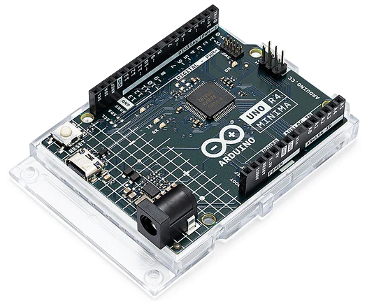

.. _uno_r4:

Arduino Uno R4 Minima
=================================

**Overview**

Enhanced and improved, the Arduino UNO R4 Minima is armed with a powerful 32-bit microcontroller courtesy of Renesas. Brace yourself for increased processing power, expanded memory, and a whole new level of on-board peripherals. The best part? Compatibility with existing shields and accessories remains intact, and there's no need to make any changes to the standard form factor or 5 V operating voltage.

Joining the Arduino ecosystem, the UNO R4 is a trusty addition suitable for both beginners and seasoned electronics enthusiasts. Whether you're just starting out or looking to push the boundaries of your projects, this robust board delivers reliable performance every time.

Here's what the UNO R4 Minima brings to the table:

* Hardware compatibility with UNO form factor: The UNO R4 Minima maintains the same form factor, pinout, and 5 V operating voltage as its predecessor, the UNO R3. This ensures a seamless transition for existing shields and projects, leveraging the extensive and unique ecosystem already established for the Arduino UNO.
* Expanded memory and faster clock: Prepare for more precise calculations and the ability to handle complex projects with ease. The UNO R4 Minima boasts increased memory and a faster clock speed, empowering you to tackle demanding tasks effortlessly.
* Extra on-board peripherals: The UNO R4 Minima introduces a range of on-board peripherals, including a 12-bit DAC, CAN BUS, and OP AMP. These additional components provide you with expanded capabilities and flexibility in your designs.
* Extended 24 V tolerance: The UNO R4 Minima now supports a wider input voltage range, allowing power supplies up to 24 V. This enables seamless integration with motors, LED strips, and other actuators, simplifying your projects by utilizing a single power source.
* SWD connector: Debugging is a critical aspect of any project. Simply connect an external debugger to the UNO R4 Minima and effortlessly monitor the inner workings of your system. Stay in control and gain valuable insights.
* HID support: The UNO R4 Minima comes with built-in HID (Human Interface Device) support, enabling it to simulate a mouse or keyboard when connected to a computer via a USB cable. This convenient feature makes it a breeze to send keystrokes and mouse movements to a computer, enhancing usability and functionality.

**Tech specs**

* Board:
    * Name: Arduino® UNO R4 Minima
    * SKU: ABX00080
* Microcontroller: Renesas RA4M1 (Arm® Cortex®-M4)
* USB: USB-C® Programming Port
* Pins:
    * Digital I/O Pins: 14
    * Analog input pin: 6
    * DAC: 1
    * PWM pins: 6
* Communication
    *  UART: Yes, 1x
    * I2C: Yes, 1x
    * SPI: Yes, 1x
    * CAN: Yes 1 CAN Bus
* Power
    * Circuit operating voltage: 5 V
    * Input voltage (VIN): 6-24 V
    * DC Current per I/O Pin: 8 mA
* Clock speed Main core 48 MHz
* Memory RA4M1 256 kB Flash, 32 kB RAM
* Dimensions
    * Width: 68.85 mm
    * Length: 53.34 mm

**Pinout**

.. image:: img/uno_r4_pinsout.png
    :width: 800

* |link_r4_datasheet|
* |link_r4_schematic|
* |link_r4_doc|