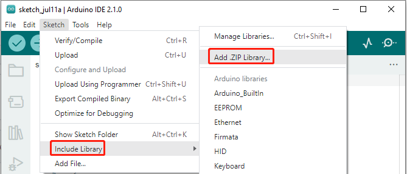
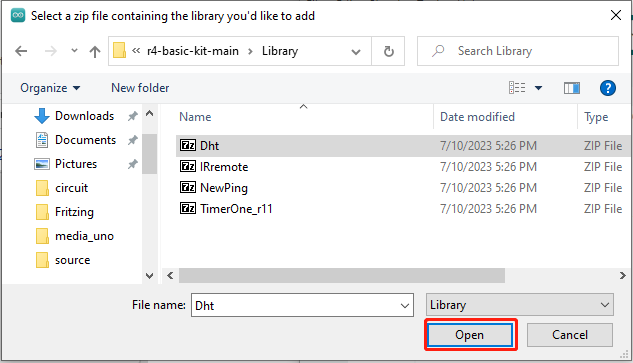
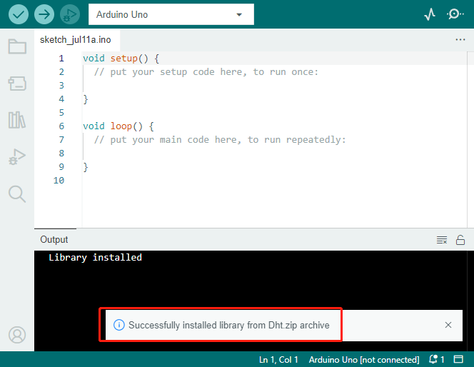
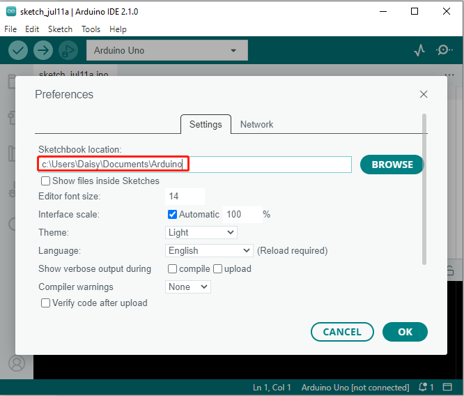
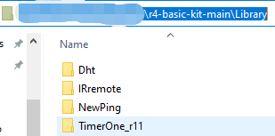
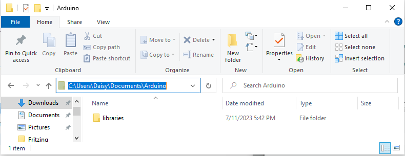
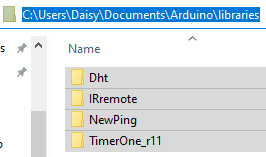

Download the Code and Install Libraries
===============================================

You can download the code package for the SunFounder Uno R4 Basic Kit from the following link:

* :download:`SunFounder Uno R4 Basic Kit <https://github.com/sunfounder/r4-basic-kit/archive/refs/heads/main.zip>`

After extracting the downloaded file, you will find four folders:

* **Code**: This folder contains all the project codes.
* **Datasheet**: This folder includes datasheets for various components used in the kit.
* **Fritzing**: This folder provides Fritzing source files for all the projects. Please note that only breadboard diagrams are available; PCB and schematic diagrams are not included.
* **Library**: This folder contains the libraries required for this kit. You can follow the tutorials provided to add these libraries to your Arduino IDE.

By utilizing these resources, you can access the project codes, component datasheets, Fritzing diagrams, and necessary libraries to explore and experiment with the SunFounder Uno R4 Basic Kit effectively.

.. _add_libraries_ar:

Add Libraries
-----------------------

A library, gathering some function definitions and header files, usually
contains two files: .h (header file, including function statement, Macro
definition, constructor definition, etc.) and .cpp (execution file, with
function implementation, variable definition, and so on). When you need
to use a function in some library, you just need to add a header file
(e.g. #include <dht.h>), and then call that function. This can make your
code more concise. If you don't want to use the library, you can also
write that function definition directly. Though as a result, the code
will be long and inconvenient to read.

Some libraries are already built in the Arduino IDE, when some others
may need to be added. So now let's see how to add one. There are 2
methods for that.

**Method 1 Add .ZIP Library**

Directly import the library in Arduino IDE (take ``Dht`` as an example
below). The advantage of this method is easy to understand and operate,
but on the other hand, only one library can be imported at a time. So it
is inconvenient when you need to add quite a lot of libraries.

**Step 1**: Select **Sketch** -> **Include Library** -> **Add ZIP
Library**.

**Step 2**: Find ``Library`` folder, Click **Open**.

**Step 3**: When you see **Library added to your libraries. Check
"Include library" menu**, it means you have added the library
successfully. Please use the same method to add other libraries then.

.. _add_lib_manual:

**Method 2 Manually Add**

You can also try to put the library in the ``libraries`` folder of your sketchbook by yourself. This method can
copy all libraries and add them at a time, but first you need to find the path where the ``libraries`` folder is located.

**Step 1**: You can find or change the location of your ``libraries`` folder at **File** > **Preferences** > **Sketchbook location**.

**Step 2**: Navigate to the directory ``r4-basic-kit-main\Library``. Start by extracting all the zip files in this folder. Once extracted, copy the contents of these files.

**Step 3**: Go to the location of your ``libraries`` folder(find from Arduino IDE), click to open it.

**Step 4**: Take the previously unzipped library folders and paste them into the "libraries" folder.

There is also a way to use the **Library Manager**, but the libraries added using this method are not necessarily compatible with the code we provide, so it is not recommended.

Here is the link to the official Arduino tutorial: https://docs.arduino.cc/software/ide-v1/tutorials/installing-libraries